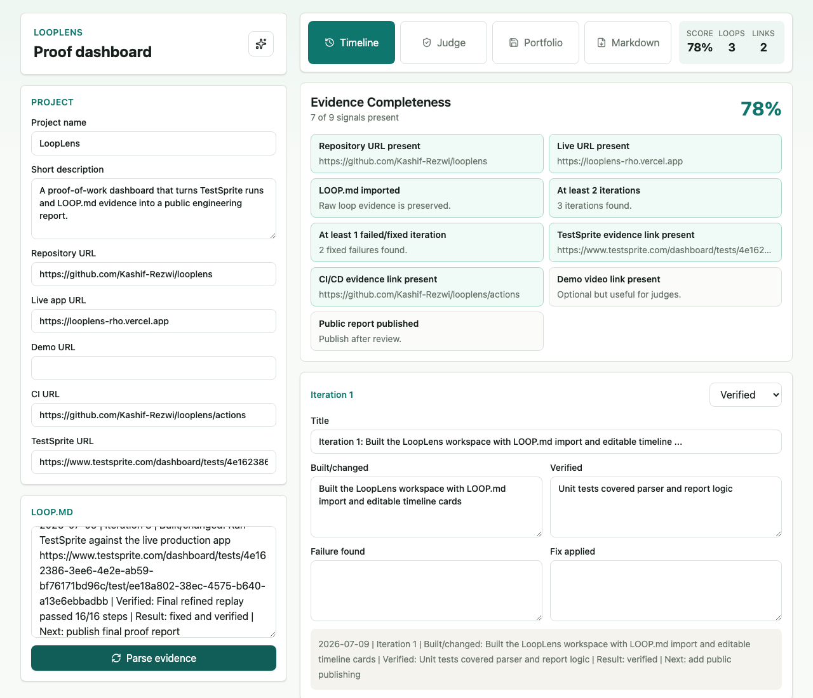
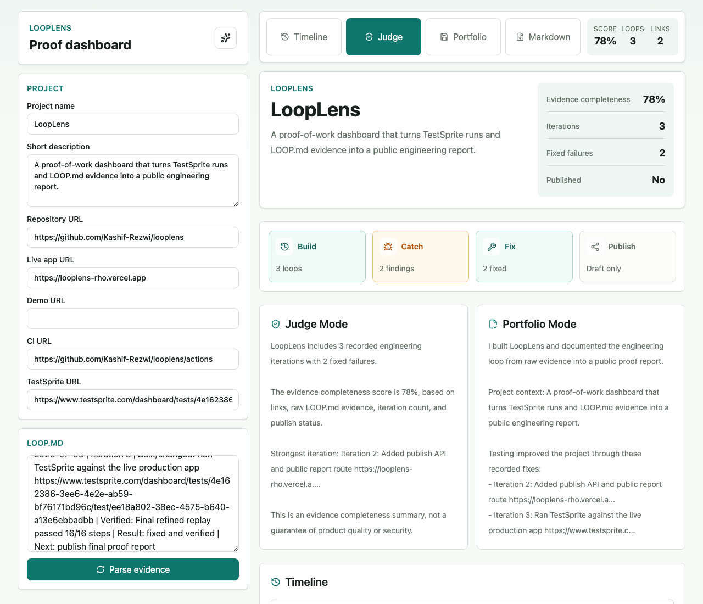
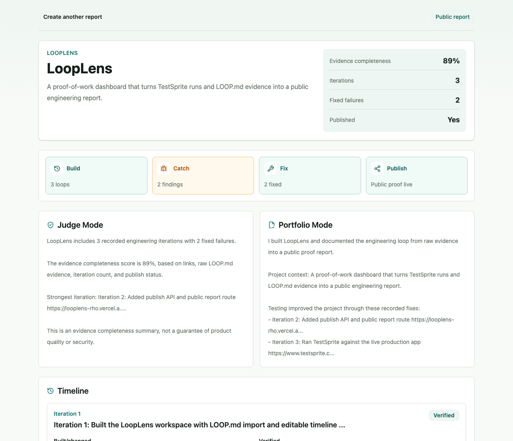

# LoopLens

LoopLens is a proof-of-work dashboard for AI-assisted software projects. It turns `LOOP.md`, TestSprite evidence, repo links, live app links, and development notes into a shareable engineering timeline.

Built for TestSprite Hackathon Season 3, LoopLens turns TestSprite runs and `LOOP.md` evidence into a public proof report that shows the write, verify, fix, and verify-again loop.

## Purpose

This README is the public entry point for humans reviewing the repository. It should explain what LoopLens is, why it exists, how the project is organized, and how to evaluate the hackathon build.

## Current Status

LoopLens is deployed and ready for TestSprite Hackathon Season 3 submission.

Core links:

```text
GitHub repo: https://github.com/Kashif-Rezwi/looplens
Live app: https://looplens-rho.vercel.app
Final LoopLens self-report: https://looplens-rho.vercel.app/report/looplens-687aa5cd
```

The final self-report was published from the real [`LOOP.md`](./LOOP.md) and is the primary public proof artifact for the project. It shows 8 recorded engineering iterations, 5 fixed failures, production publish evidence, and the final TestSprite verification harness fix.

## Screenshots

### Workspace Timeline



### Judge Mode



### Public Report



Implemented:

- Next.js App Router workspace
- `LOOP.md` paste/import and forgiving parser
- Editable timeline cards
- Timeline, Judge Mode, Portfolio Mode, and Markdown export
- Evidence completeness score
- Public report route
- Postgres JSON persistence contract for published reports
- Neon-backed production report storage
- Development file-store fallback for local Playwright verification
- Unit tests and Playwright smoke tests

## Production Proof Summary

LoopLens was verified through a real build, test, fix, and verify loop:

- Local unit and report-logic tests covered parsing, Markdown export, summaries, and scoring.
- Playwright E2E covered sample report loading, create/parse/publish/open/export flow, and mobile overflow.
- Production publishing was verified against the deployed Vercel app and Neon-backed public report storage.
- TestSprite exercised the live public proof flow against `https://looplens-rho.vercel.app`.
- A TestSprite generated-test brittleness issue was diagnosed as a verification harness problem, then fixed by replacing brittle slug/XPath assertions with deterministic Playwright assertions.
- Final TestSprite replay passed cleanly: `16/16` steps passed, `0` failed.

## TestSprite Evidence

TestSprite CLI was run against the live production app at `https://looplens-rho.vercel.app`.

- TestSprite project: `4e162386-3ee6-4e2e-ab59-bf76171bd96c`
- Test ID: `ee18a802-38ec-4575-b640-a13e6ebbadbb`
- Final passed run ID: `a235ee61-9fd0-4449-b55d-f764457617ad`
- Final result: `16/16` steps passed, `0` failed
- Dashboard: https://www.testsprite.com/dashboard/tests/4e162386-3ee6-4e2e-ab59-bf76171bd96c/test/ee18a802-38ec-4575-b640-a13e6ebbadbb

Earlier TestSprite runs were marked `blocked` even though the generated report was verified in the UI. Artifact review showed that the app was working and the issue came from brittle generated assertions, including hard-coded public report slugs and absolute XPath selectors. The final refined run used deterministic assertions and passed cleanly. Details are summarized in [.testsprite/latest-refined-run-summary.md](./.testsprite/latest-refined-run-summary.md).

## Product Context

AI coding agents make it easier to generate code quickly. The more valuable signal is whether a developer can prove the app was tested, failed in meaningful ways, improved, and passed after fixes.

LoopLens helps developers show:

- What they built
- What they tested
- What failed
- What they fixed
- What passed afterward
- What evidence supports the work

## MVP

The hackathon MVP lets a user:

- Create a project report
- Add repo URL, live app URL, description, and optional evidence links
- Paste `LOOP.md`
- Parse loop entries into timeline cards
- Edit parsed iterations
- View Timeline, Judge Mode, and Portfolio Mode
- Generate an evidence completeness score
- Publish a public report
- Export the report as Markdown

## Local Development

```bash
npm install
npm run dev
```

Open `http://localhost:3000`.

Useful checks:

```bash
npm run lint
npm run typecheck
npm test
npm run build
npm run test:e2e
```

Playwright starts the app locally and uses the development file-store fallback for publish/share verification.

## Persistence

Production publishing expects `DATABASE_URL` and stores published reports in one Postgres table. The deployed app is configured with Neon Postgres for production.

```bash
psql "$DATABASE_URL" -f scripts/schema.sql
```

Local development without `DATABASE_URL` writes temporary published reports to the OS temp directory. Public production reports must use Postgres.

## Repository Guide

- [AGENT.md](./AGENT.md): Instructions for AI coding agents working on LoopLens.
- [LOOP.md](./LOOP.md): Agent-written iteration log for the TestSprite hackathon loop.
- [SUBMISSION.md](./SUBMISSION.md): Final hackathon submission package and ready-to-paste Discord text.
- [_doc/](./_doc): Product, MVP, architecture, testing, and submission planning.
- [src/](./src): Application source.
- [tests/](./tests): Unit fixtures, parser tests, report logic tests, and Playwright E2E smoke tests.
- [public/](./public): Future static assets.
- [scripts/](./scripts): Future helper scripts.
- [.testsprite/](./.testsprite): TestSprite plan files, run notes, and refined live-run summary.
- [.github/](./.github): GitHub Actions CI and future repository automation.

## Development Principle

LoopLens should be built as a trustworthy engineering artifact, not a broad project management app. The MVP should stay focused on turning evidence into a clear public proof page.

## Hackathon Readiness

Submission package status:

- Live public URL: complete
- Public GitHub repo: complete
- TestSprite CLI usage: complete
- Agent-written `LOOP.md`: complete
- README with app, live URL, loop coverage, and TestSprite evidence: complete
- Public LoopLens report for LoopLens itself: complete
- GitHub Actions CI workflow: included
- Optional demo video: not included

## Known Dependency Note

`npm audit` currently reports a moderate PostCSS advisory through Next.js `16.2.10`'s nested dependency. `npm audit fix --force` suggests a breaking downgrade, so the project keeps the current Next version and records this as upstream dependency risk until a compatible Next release resolves it.
